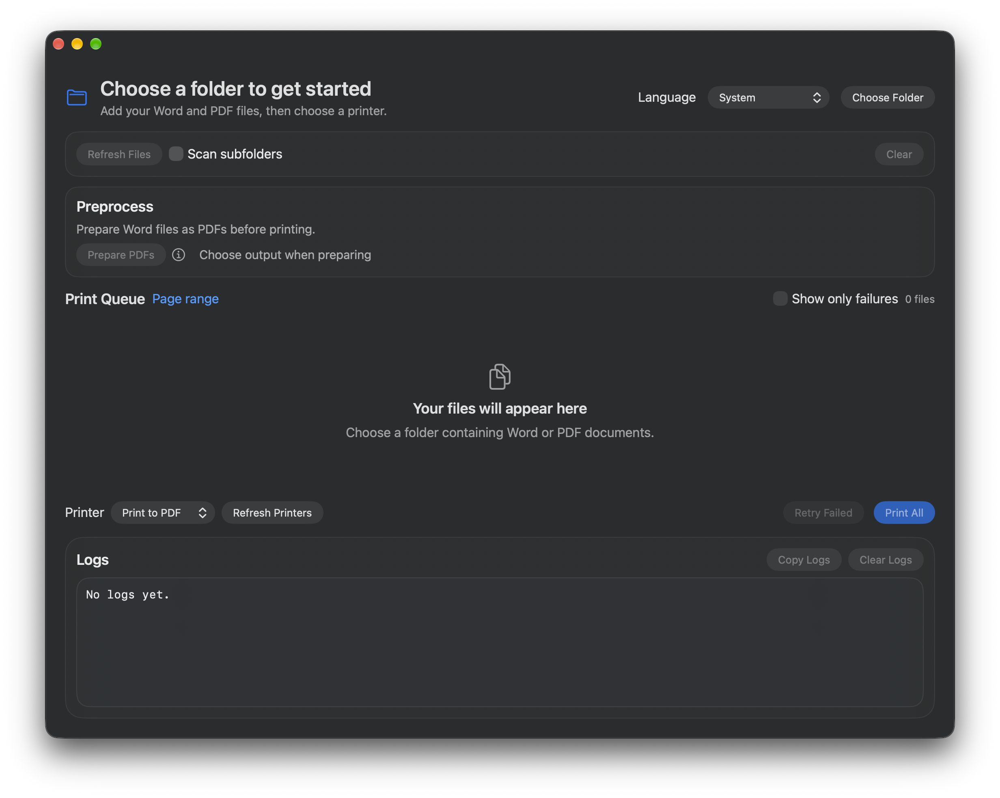

# BatchPrinter



A native macOS app for batch printing Word and PDF files, with PDF preparation,
Quick Look preview, and per-file page ranges and copy counts.

## Requirements

- macOS 14.0+
- Xcode 16+ (Swift 6)
- Microsoft Word for Mac to process Word documents

## Get Started

1. Open `BatchPrinter.xcodeproj` in Xcode, select the `BatchPrinter` scheme,
   configure signing if needed, and run.
2. Choose a folder; enable **Scan subfolders** if needed.
3. Prepare Word documents as PDFs, allowing Automation access to Word when prompted.
4. Set page ranges and copies, choose a printer or **Print to PDF**, and print.

Page ranges accept `3`, `2-6`, or `4,2,1`; entered order is preserved.
Supported files: `.doc`, `.docx`, `.docm`, `.dot`, `.dotx`, `.dotm`, and `.pdf`.

## Queue Controls

- **Refresh Files** preserves page/copy settings and selection, but resets
  preparation and submission information.
- **Preview** shows the prepared PDF when available, otherwise the original file.
- **Retry Failed** retries failed jobs only. Jobs needing preparation are prepared
  and selected for **Print Selected** afterward.
- **Cancel** takes effect between files; the current file finishes first.

Close source documents in Word before preparation. Word dialogs can pause a batch.
**Submitted** means the print system accepted the job; printer completion is not
tracked. PDF exports show **Saved**.

## Development

```sh
just          # List commands
just format   # Format Swift files
just lint     # Check formatting
```

Run tests with **Command-U** in Xcode or:

```sh
xcodebuild test -project BatchPrinter.xcodeproj -scheme BatchPrinter -destination 'platform=macOS' CODE_SIGNING_ALLOWED=NO
```

Tests cover page selection, filename collisions, cancellation, recovery, refresh,
and preview selection without automating Word or submitting print jobs.
GitHub Actions builds and tests pushes and pull requests to `main`.
